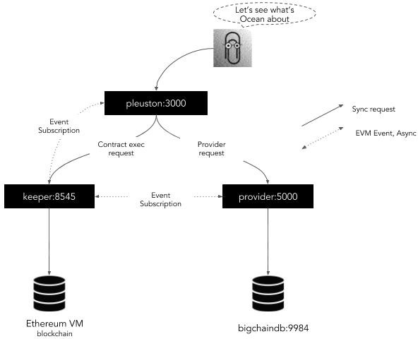

[](https://oceanprotocol.com)

<h1 align="center">docker-images</h1>

> 💧 Ocean Protocol & Docker
> [oceanprotocol.com](https://oceanprotocol.com)

Docker compose and tools running the complete Ocean Protocol stack

## Table of Contents

   * [docker-images](#docker-images)
      * [Table of Contents](#table-of-contents)
      * [Disclaimer](#disclaimer)
      * [Get Started](#get-started)
         * [Docker](#docker)
         * [Running options](#running-options)
      * [Ocean components](#ocean-components)
      * [Contributing](#contributing)
      * [License](#license)

---

## Disclaimer

Current implementation is an **alpha version**, so you can expect running into problems. The current implementation only support assets stored in Microsoft Azure storage.

## Get Started

For local development you can use Docker & Docker Compose. To do that you need to have the newest versions available of both:

* [Docker](https://www.docker.com/get-started)
* [Docker Compose](https://docs.docker.com/compose/)

### Docker

The most simple way to get started is with Docker compose:

```bash
docker-compose --project-name=ocean up
```

This will give you a local instance of Ocean Protocol.

After getting everything running, you could open the browser and access the **Pleuston Frontend** application:

```
http://localhost:3000
```

### Running options

This repository provides an script with different options to facilitate the execution of different setups:

```bash
./start_ocean.sh
```

By default the script starts Ganache and deploy the keeper-contracts there. If you want to use a **Parity Client** and **Secret Store** running in local, you can use the option `--local-parity-node`.
```bash
./start_ocean.sh --latest --no-pleuston --local-parity-node
```

If you need an account with balance in that parity client, you can use the following:

```
parity.address="0x00bd138abd70e2f00903268f3db08f2d25677c9e"
parity.password="node0"
```

## Ocean components

The Ocean Docker compose starts the following components:

* **Pleuston** frontend application. Listening on port **3000**.
* **Aquarius**. Listening on port **5000**.
* **Brizo**. Listening on port **8030**.
* **Keeper contracts**. Listening on port **8545**.
* **MongoDB**. Listening on port **27017**.
* **Secret Store**. Listening on port **12001**.



## Contributing

We use GitHub as a means for maintaining and tracking issues and source code development.

If you would like to contribute, please fork this repository, do work in a feature branch, and finally open a pull request for maintainers to review your changes.

Ocean Protocol uses [C4 Standard process](https://github.com/unprotocols/rfc/blob/master/1/README.md) to manage changes in the source code.  Find here more details about [Ocean C4 OEP](https://github.com/oceanprotocol/OEPs/tree/master/1).

## License

```
Copyright 2018 Ocean Protocol Foundation

Licensed under the Apache License, Version 2.0 (the "License");
you may not use this file except in compliance with the License.
You may obtain a copy of the License at

   http://www.apache.org/licenses/LICENSE-2.0

Unless required by applicable law or agreed to in writing, software
distributed under the License is distributed on an "AS IS" BASIS,
WITHOUT WARRANTIES OR CONDITIONS OF ANY KIND, either express or implied.
See the License for the specific language governing permissions and
limitations under the License.
```
