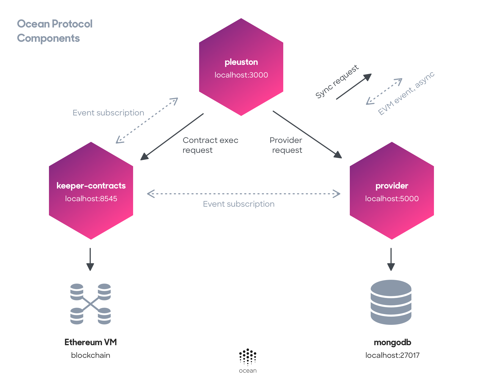

[](https://oceanprotocol.com)

<h1 align="center">docker-images</h1>

> 🐳 Docker compose and tools running the complete Ocean Protocol network stack.
> [oceanprotocol.com](https://oceanprotocol.com)

---

**🐲🦑 THERE BE DRAGONS AND SQUIDS. This is in alpha state and you can expect running into problems. If you run into them, please open up [a new issue](https://github.com/oceanprotocol/docker-images/issues). 🦑🐲**

---

## Table of Contents

  - [Prerequisites](#prerequisites)
  - [Get Started](#get-started)
     - [Script Options](#script-options)
  - [Ocean Protocol components](#ocean-protocol-components)
     - [Environment Variables](#environment-variables)
  - [Contributing](#contributing)
  - [License](#license)

---

## Prerequisites

You need to have the newest versions available of both:

* [Docker](https://www.docker.com/get-started)
* [Docker Compose](https://docs.docker.com/compose/)

## Get Started

Then bring up an instance of the whole Ocean Protocol network stack with the `start_ocean.sh` script:

```bash
git clone git@github.com:oceanprotocol/docker-images.git
cd docker-images/

./start_ocean.sh
```


This will bring up the `stable` versions of all components, referring to their respective `master` branches.

To get the `latest` versions of all components, referring to their `develop` branches, pass the argument `--latest`:

```bash
./start_ocean.sh --latest
```

After getting everything running, you can open the **Pleuston Frontend** application in your browser:

```
http://localhost:3000
```

### Script Options

The script provides the following options:

Option | Description 
---    | --- 
`--latest` | Get the `latest` versions of all components, referring to their `develop` branches.
`--no-pleuston` | Start up Ocean without an instance of `pleuston`. Helpful for development on `pleuston`.
`--local-parity-node` | Runs a local parity POA node instead of ganache-cli.
`--reuse-database` | Start up Ocean and reuse the Database from ganache. Helpful for development.

## Ocean Protocol components

The Ocean Docker compose starts the following components:

* [🦄 pleuston](https://github.com/oceanprotocol/pleuston). Frontend listening on port `3000`.
* [🐋 aquarius](https://github.com/oceanprotocol/aquarius). Backend listening on port `5000`.
* [💧 keeper-contracts](https://github.com/oceanprotocol/keeper-contracts). RPC client listening on port `8545`.



### Environment Variables

The `start_ocean.sh` script and `.env` file sets defaults for the following environment variables but you can use these in combination with the Docker Compose files for further customization, e.g.:

```bash
export REUSE_DATABASE="true"
docker-compose --project-name=ocean -f docker-compose-no-pleuston.yml up
```

Variable | Description 
---      | --- 
`REUSE_DATABASE` | The keeper-contracts component runs with ganache by default and every run will produce and deploy new instances of the keeper contracts. Ganache can be run with a specific database path by setting the env var `REUSE_DATABASE` to `"true"`. By default, the ganache database will be setup in the cwd.
`DEPLOY_CONTRACTS` | skip deploying smart contracts by setting this to `"false"`, in this case `REUSE_DATABASE` should be set to `"true"` in the previous run when using ganache
`KEEPER_NETWORK_NAME` | set to one of `"ganache"` (default), `"kovan"`, or `"ocean_poa_net_local"`
`ARTIFACTS_FOLDER` | this is where the deployed smart contracts abi files will be available. This can be pointed at any path you like.

A subset of the components can be run by modifying the docker-compose file directly or by using one of the other pre-built compose files:

Compose file | Description 
---          | --- 
`docker-compose-no-pleuston.yml` | runs all components without the pleuston. This is useful for developing/debugging the front-end app. So first the docker compose container can be started then pleuston can be started separately from source. You can also use `./start_ocean.sh --no-pleuston` to do this
`docker-compose-local-parity-node.yml` | similar to the above with no pleuston, but runs a local parity POA node instead of ganache-cli. You can also use `./start_ocean.sh --local-parity-node` instead

## Contributing

We use GitHub as a means for maintaining and tracking issues and source code development.

If you would like to contribute, please fork this repository, do work in a feature branch, and finally open a pull request for maintainers to review your changes.

Ocean Protocol uses [C4 Standard process](https://github.com/unprotocols/rfc/blob/master/1/README.md) to manage changes in the source code. Find here more details about [Ocean C4 OEP](https://github.com/oceanprotocol/OEPs/tree/master/1).

## License

```
Copyright 2018 Ocean Protocol Foundation

Licensed under the Apache License, Version 2.0 (the "License");
you may not use this file except in compliance with the License.
You may obtain a copy of the License at

   http://www.apache.org/licenses/LICENSE-2.0

Unless required by applicable law or agreed to in writing, software
distributed under the License is distributed on an "AS IS" BASIS,
WITHOUT WARRANTIES OR CONDITIONS OF ANY KIND, either express or implied.
See the License for the specific language governing permissions and
limitations under the License.
```
